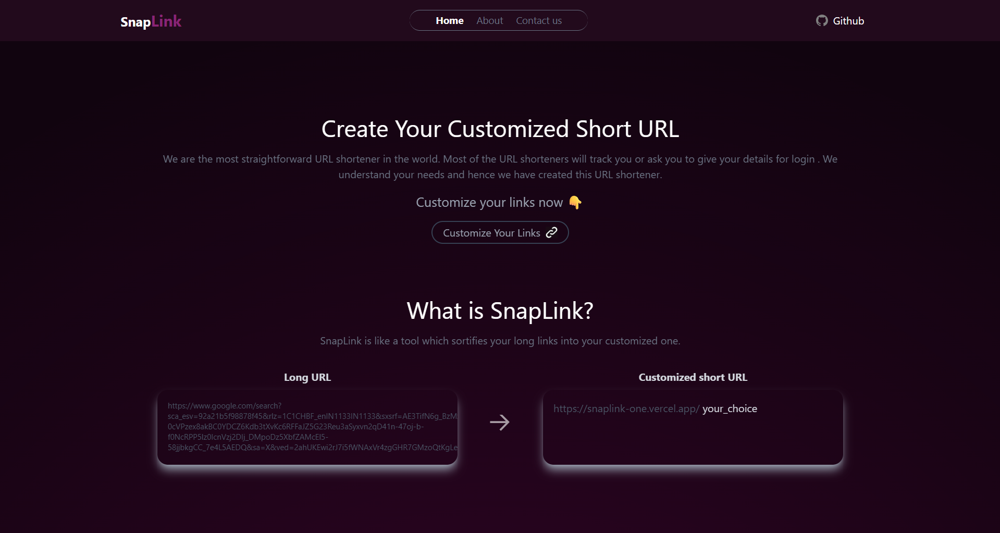
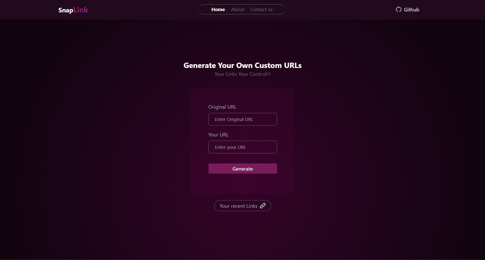
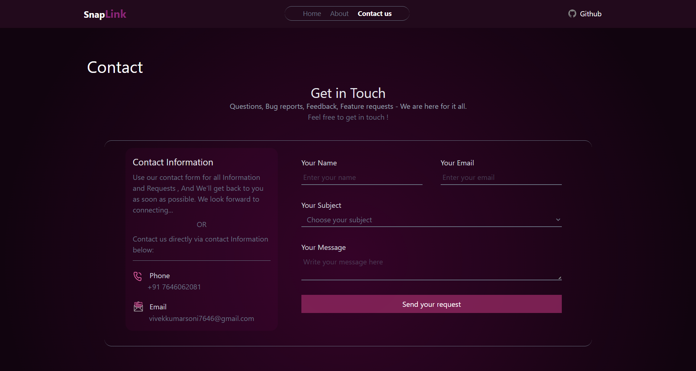
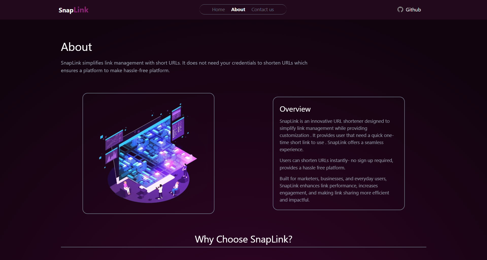

# 🔗 SnapLink

[](https://nextjs.org/)
[](https://react.dev/)
[](https://www.mongodb.com/)
[](https://tailwindcss.com/)
[](https://vercel.com/)

SnapLink is a simple and powerful **URL Shortener Website** built with **Next.js, React, MongoDB, and Tailwind CSS**.  
It allows users to shorten long URLs into clean, shareable links — or even create **custom short links**.  
The platform also provides **link management features** such as copy, delete, and open.

---

## ✨ Features

- 🔒 **Shorten URLs** – Convert long, messy URLs into short and neat links.  
- 📝 **Custom Short Links** – Create personalized short URLs of your choice.  
- 📋 **Link Management** – Copy, delete, or open links directly from the Recent Link Page.  
- ⚡ **Fast & Responsive** – Built with **Next.js + Tailwind CSS** for high performance.  
- 🗄 **Database Integration** – URLs stored and managed securely with **MongoDB**.  

---

## 🛠 Tech Stack

- **Frontend:** Next.js, React, Tailwind CSS  
- **Backend:** Next.js API Routes  
- **Database:** MongoDB   
- **Other Tools:** Vercel (for deployment), GitHub  

---

## 🚀 Getting Started

Follow these steps to run SnapLink locally:

### 1. Clone the repository
```bash
git clone https://github.com/vivek-code-200/snaplink.git
cd snaplink
```

### 2. Install dependencies
```bash
npm install
```

### 3. Set up environment variables  
Create a `.env.local` file in the project root and add:
```env
MONGODB_URI=your_mongodb_connection_string
NEXT_PUBLIC_BASE_URL=http://localhost:3000
```

### 4. Run the development server
```bash
npm run dev
```

App will be running at **http://localhost:3000** 🎉

---

## 📸 Screenshots

### 🏠Home Page


### 🔗Link Generating Page


### 🔗Link Mangement Page


### 📞Contact Page


### 🗣️About Page

---


## 🤝 Contributing

Contributions are always welcome!  
- Fork the repo  
- Create a new branch (`new-feature`)  
- Commit your changes  
- Submit a pull request  

---

## 📜 License

This project is licensed under the **MIT License**.  

---

## 👨‍💻 Author

**SnapLink** is developed by Vivek Kumar Soni(https://github.com/vivek-code-200).  

